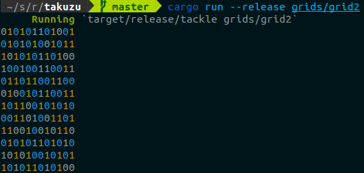

# Takuzu solver

a.k.a. "Binairo"

Library and solver for the takuzu number puzzle game.

To use the solver:

```shell
$ git clone https://github.com/Letheed/takuzu.git
$ cd takuzu
$ cargo run --release [FILE]...
```
or
```shell
$ cargo install takuzu
$ takuzu-solver [FILE]...
```


For the `FILE` format, see the [library documentation](https://letheed.github.io/takuzu/takuzu/index.html) and the [examples](grids).

For additional details on the binary, see the [binary documentation](https://letheed.github.io/takuzu/takuzu_solver).
